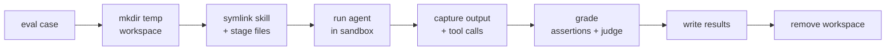

# How evaluations run

Authoring a suite is one half; the other is knowing what evolve _does_ with it. This page traces a case from the
authored file to a committed result — the throwaway workspace, the agent invocation, grading, the baseline, and cleanup.

The three tiers run independently, and `evolve run all` chains them:

| Tier | Command               | Workspace?           | Agent?           | What it measures                       |
| ---- | --------------------- | -------------------- | ---------------- | -------------------------------------- |
| 0    | `evolve run checks`   | no                   | no               | Static validity of manifests and specs |
| 1    | `evolve run triggers` | yes (all skills)     | yes (not graded) | Activation accuracy                    |
| 2    | `evolve run evals`    | yes (skill isolated) | yes (graded)     | Behavioral correctness                 |

Tier 0 is pure static analysis — it parses `SKILL.md` frontmatter, plugin/marketplace manifests, and your
`triggers`/`evals` files, and reports anything malformed. No workspace, no model. It's the fast gate before you spend a
run.

## The throwaway workspace

Both eval tiers run the agent inside a fresh temporary directory, created under `$TMPDIR` with a unique name. Into it
evolve seeds two things:

- **The skill(s), as symlinks** into the provider's skills directory (e.g. `.claude/skills/`). This is the one place
  triggers and evals deliberately differ: a **trigger** workspace links in _every_ skill, so the model has to choose the
  right one; an **eval** workspace links in _only the skill under test_, so a pass reflects that skill and nothing else.
- **The `files` fixtures**, copied in byte-for-byte at the destinations described in [Behavioral evals](evals.md).

While the agent runs, an OS sandbox confines its writes to the workspace, so a misbehaving run can't touch the rest of
your machine (disable with `--no-sandbox`). When the case finishes and grading is done, the workspace is removed. Pass
`--keep-workspaces` to leave them on disk for debugging — useful when an assertion fails and you want to see exactly
what the agent produced.

## Running a behavioral eval

For Tier 2, the harness driving the model builds the actual CLI invocation from the case: the `prompt`, the
`allowed_tools` allowlist, `max_turns`, `timeout_seconds`, and the provider-specific model id. evolve runs it through
the one harness bound to that model — evals execute **once per model**, never once per harness.

When the run returns, evolve captures two things from the agent's output: its **final response text** (ANSI-stripped)
and the **tool calls it made**. Those feed grading — the response and workspace for `regex`/`file_exists`/`command`, the
observed calls for `tool_call`.

Driving a model for a graded eval needs a harness with the **eval-runner** capability (Claude Code and Codex today);
harnesses without it are trigger-only. `evolve doctor` and `evolve models` show which models are runnable in your
environment.

## Running a trigger

For Tier 1 there's nothing to grade in the workspace — the question is purely _did the skill fire_. evolve seeds one
shared workspace containing every skill and runs each `query` `--runs` times against it. Activation is detected by
watching the agent's streamed tool use: a **hit** is recorded when the agent invokes the `Skill` tool naming the skill
under test, or opens that skill's `SKILL.md` with `Read`. Reaching for the skill _is_ the activation; evolve doesn't
need the rest of the turn.

Scoring then follows the rule from [Triggers](triggers.md): a query passes when its hit-rate is `≥ 0.5` for
`should_trigger: true` (or `< 0.5` for `false`), and the skill's per-model score is the share of queries that passed.

## Grading

Grading runs in two passes, both against the finished workspace and the captured response:

- **Deterministic assertions** — `file_exists`, `file_absent`, `regex`, `not_regex`, `command`, `tool_call`. These stat
  files, match RE2 patterns, run shell commands through the real toolchain, and inspect observed tool calls. Fast and
  reproducible.
- **The LLM judge** — `llm` assertions and `expectations`. The judge is pinned to `claude-sonnet-4-6` _regardless of the
  model under test_, so verdicts stay comparable across providers. It reads the assertion text, the eval's
  `expected_output` as context, and the agent's final response, and may `Read`/`Glob`/`Grep` the workspace before
  returning a pass/fail verdict with a short evidence quote.

Every check is **tri-state**: pass, fail, or _skipped_. A `command` whose `requires` binary is missing, or a `tool_call`
against a harness that can't report tool calls, is skipped — it counts neither for nor against the case, so a suite
stays portable across machines. The full type reference is in [Assertions](assertions.md).

## The baseline (a skill's lift)

A high pass rate only means something relative to what the model does _without_ the skill. With `--baseline` (on by
default), each eval also runs once with **no skill installed**, interleaved with the real run. The gap between the two
is the skill's measured **lift** — the part of the score the skill is actually responsible for. Baselines are cached and
recomputed only when the eval or its fixtures change, so they don't re-run every sweep.

## Writing results

Outcomes are written to one committed `results.<ext>` per skill, keyed by `provider/model-id`. A sweep rewrites only the
entries it ran and leaves the rest untouched, so diffs stay scoped to what changed. The write is atomic (a temp file
swapped into place) and **deterministic** — sorted keys, fixed field order, rounded floats, trailing newline — so
re-running an unchanged suite produces a byte-identical file and reports re-render cleanly as the model matrix moves.

Because finished entries are preserved, sweeps resume: `--new` fills only missing or stale results, `--modified` reruns
only cases whose authored content changed, and `--failed` reruns only the ones that didn't pass. An interrupted run
picks up where it left off.

From here, `evolve report` renders the committed results into `EVALUATION.md` / `EVALUATION.json` — see the
[Reference](../reference.md) for the report commands and the full flag set.
